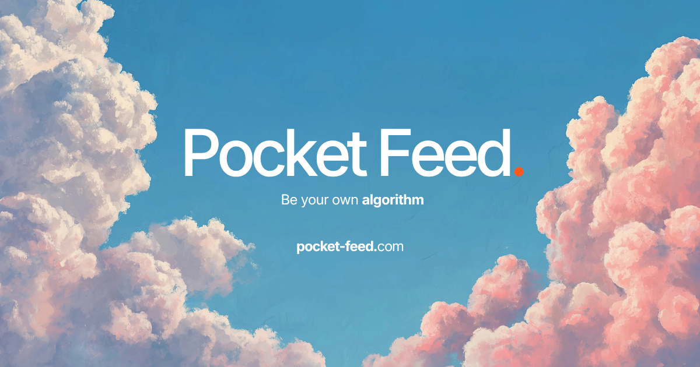

# Pocket Feed

A social feed reader built on the AT Protocol — follow your favourite feeds in one place.

## Quick Start

Clone the project

```bash
git clone https://github.com/geekychakri/pocketfeed.git
```

Go to the project directory

```bash
cd pocketfeed
```

Install dependencies

```bash
npm install
```

Create an .env file in root and add your variables

```
DATABASE_URL=
DATABASE_URL_UNPOOLED=
UPSTASH_REDIS_REST_URL=
UPSTASH_REDIS_REST_TOKEN=
IRON_SESSION_PASSWORD=
PRIVATE_KEY=
YOUTUBE_API_KEY=
```

Start the app

```bash
npm run dev
```

## Stack

- **NextJS**
- **NeonDB**
- **Drizzle**
- **ATProto**
- **TypeScript**
- **Motion**
- **Zustand**
- **Tailwind CSS**
- **Base UI**

## License

[MIT](LICENSE)
